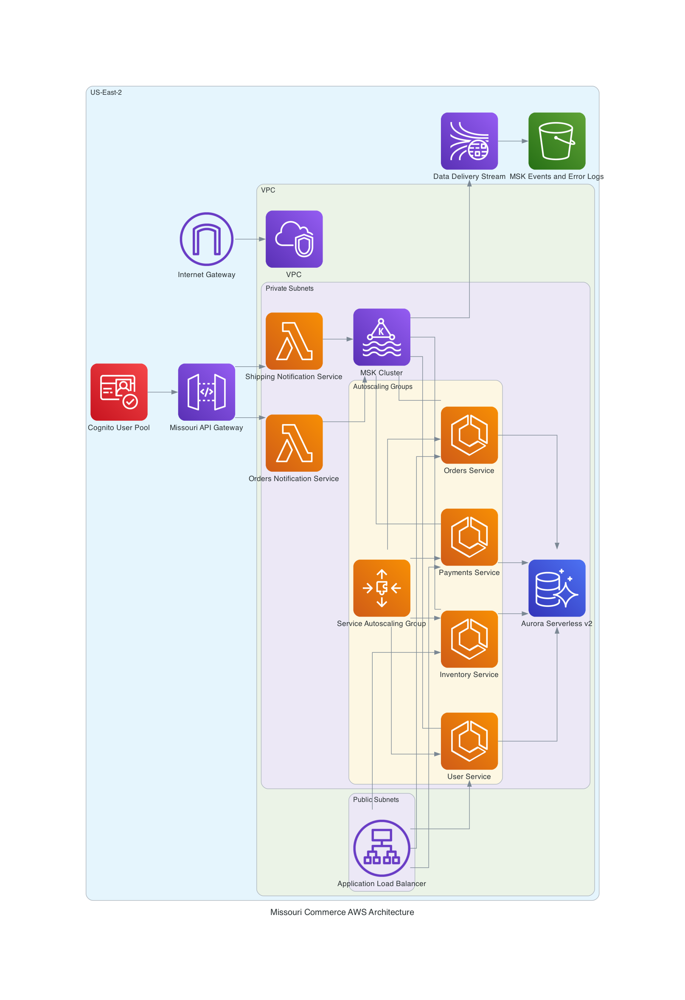

# AWS North Project

## Introduction 
This project provides an extensive terraform module for provisioning the central components
in this diagram



## Guide to Repository

```
.
├── README.md
├── diagrammer # generates aws diagram
│   ├── architecture.png
│   ├── aws-north.code-workspace
│   ├── diagram.py
│   ├── poetry.lock
│   └── pyproject.toml
├── taskfile.yml # defines tasks to execute
└── terraform
    ├── environments
    │   └── dev
    ├── main.tf
    ├── modules
    │   ├── apigateway
    │   ├── cognito
    │   ├── db
    │   ├── fargate
    │   ├── firehose
    │   ├── kms
    │   ├── lambda
    │   ├── lb
    │   ├── msk
    │   ├── network
    │   ├── secretsmanager
    │   └── storage
    ├── provider.tf
    ├── terraform.tfvars # non-sensitive variables only
    └── variables.tf
```

## Terraform Plan

A pretty printed version of the plan can be seen in this PR representing the work (created via Github Actions)
https://github.com/ASRagab/aws-north-project/pull/1


## Prerequisites

1. Install Task:
   - macOS: `brew install go-task`
   - Linux: `sh -c "$(curl --location https://taskfile.dev/install.sh)" -- -d -b /usr/local/bin`
   - Windows: `choco install go-task`

2. Install Terraform (1.9.x):
   - Visit https://www.terraform.io/downloads.html and follow instructions for your OS

3. Install AWS CLI:
   - Visit https://aws.amazon.com/cli/ and follow instructions for your OS

Terraform Provisioning is facilitated via HCP Terraform Cloud, some secrets are stored there like AWS Keys, and the `cognito_username` and `cognito_user_password`

## Clone the project

```
git clone https://github.com/ASRagab/aws-terraform-project.git
cd aws-terraform-project
```

## Authentication
To authenticate using AWS SSO for the Terraform admin profile, follow these steps:

1. Configure AWS SSO:
   - Run `aws configure sso`
   - Follow the prompts to set up your SSO session (you can get the url and other credential materials from 1Password)
   - When asked for a profile name, enter `north`

2. Use the SSO profile:
   - To use this profile for AWS CLI commands, prefix them with `AWS_PROFILE=north`
   - For Terraform, set the AWS_PROFILE environment variable:
     ```
     export AWS_PROFILE=north
     ```
   - Consider using [direnv](https://direnv.net/) for automatic environment variable loading
   - Also consider a tool like [aws-sso-cli](https://github.com/synfinatic/aws-sso-cli) for easier SSO management

3. Verify the configuration:
   - Run `aws sts get-caller-identity` to confirm you're using the correct profile

Note: Ensure you have the necessary permissions in AWS SSO to perform Terraform operations.

## Setup

Run `task tfp` to initialize and plan the terraform.

## Notes

I think one important design decision was the use of a service per-cluster model
for Aurora Serverless V2. The V2 implementation is specifically design for spiky
workloads, and rapid scaling/descaling. The tradeoff is expense, it's not a cheap 
service.

Other considerations I would make is a more thoughtful arrangement and cidr
block definition strategy, network saturation can be a very difficult problem
to work around, once you've committed in truth multiple-VPCs would be needed,
and more comprehensive design session about all the necessary services, that
are not in the diagram (such the frontend and caches)

If I wanted to spend more time, I would have added a WAF
